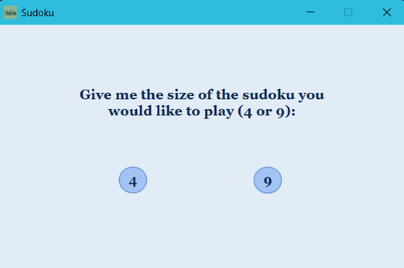
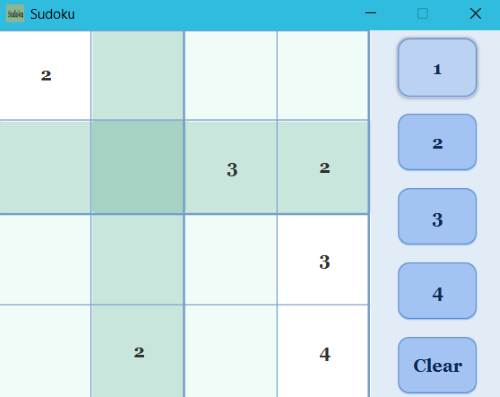
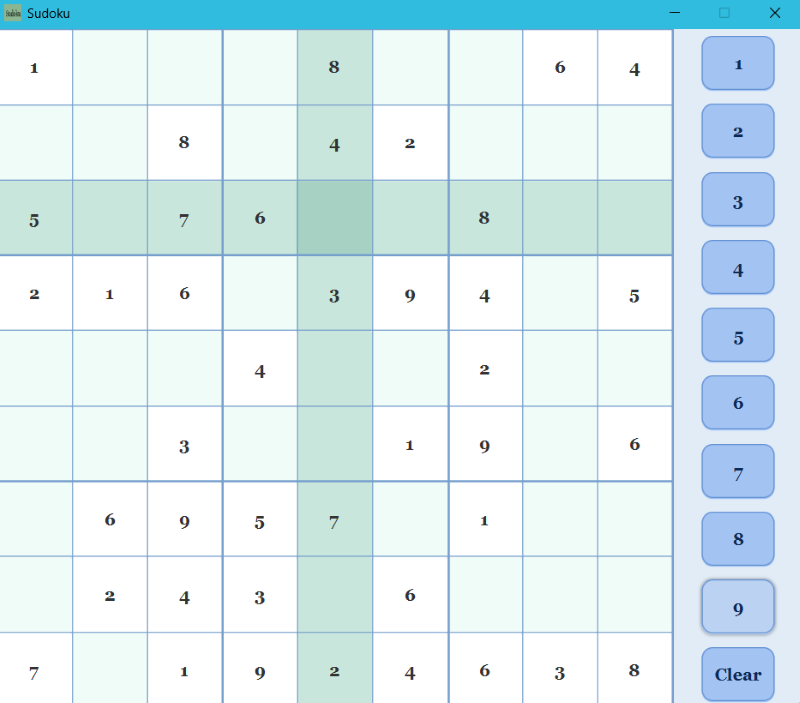
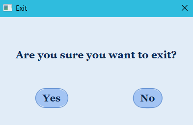
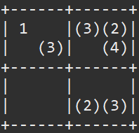
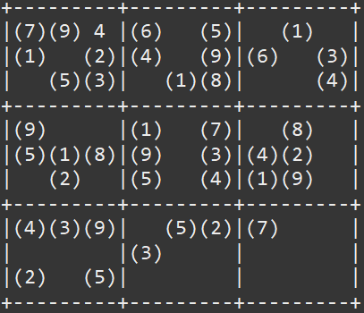

# Sudoku Game in Java

This repository contains two implementations of Sudoku in Java: 
1. A **JavaFX GUI version** 
2. A **terminal-based version**. 

Both versions are launched via the `Sudoku.java` class, which asks the user whether they want to play the graphical or terminal game.

## How It Works

1. Run `Sudoku.java`.
2. You will be prompted to select the game mode:
   - **GUI**: Play using the JavaFX graphical interface.
   - **Terminal**: Play in the console.
3. For both versions, you will then select:
   - Board size: 4x4 or 9x9
   - Difficulty level: Easy, Medium, or Hard

## Sudoku GUI Game

A graphical Sudoku game using JavaFX.

### Features

- **4x4 and 9x9 boards**
  
   - Select your board size:
  
     

   - Example of 4x4 board:
  
     

   - Example of 9x9 board:
  
     

- **Multiple difficulty levels (Easy, Medium, Hard)**
  
  

- **Invalid Move Highlight**
    
  
  
- **Ending scene when puzzle is solved**
  
  

- **Exit scene**
  
  

- **Non-resizable, non-fullscreen window** for consistent layout

### How to Play (GUI)

- **Select a cell** by clicking on it in the grid.
- **Fill the cell** by clicking the number buttons on the left panel.
- **Clear a cell** using the "Clear" button to remove a number you have entered.
- **Illegal moves** are highlighted in **red** (cannot place a number that violates Sudoku rules).
- **Complete the puzzle** to trigger the ending scene.

## Terminal Sudoku Game

A text-based version playable in the console.

### Features
- Play 4x4 or 9x9 Sudoku in terminal

   - Example of 4x4 board:
  
     

   - Example of 9x9 board:
  
      
  
- Difficulty levels: Easy, Medium, Hard
- Fixed cells displayed in parentheses
- Invalid moves are rejected with an error message
- Game ends when the board is correctly filled

### How to Play (Terminal)

- The board is displayed in the console with **fixed cells in parentheses**.
- Enter your moves using **row, column, and number** format, e.g., `1,3=4` to place number 4 in row 1, column 3.
- To **clear a cell**, enter `row,column=0`.
- To **exit the game**, enter `0,0=0`.
- **Invalid moves** (placing a number that violates Sudoku rules) are rejected with an error message.
- Complete the puzzle to finish the game.

## Requirements & Running

### Requirements
- **Java 21 (JDK)**  
- **JavaFX 21 SDK** (required only for the GUI version)  
  - Download JavaFX from: [https://openjfx.io](https://openjfx.io)  

### How to run

This project is best run in **Eclipse**:

1. Import the project into Eclipse as a Java project.
2. Add the JavaFX SDK to the **module path**:
   - Open **Run Configurations → Arguments → VM arguments**.
   - Add:
     ```
     --module-path "PATH_TO_YOUR_JAVAFX_LIB" --add-modules javafx.controls,javafx.fxml,javafx.graphics,javafx.base
     ```
     Replace `PATH_TO_YOUR_JAVAFX_LIB` with the path to the `lib` folder of your JavaFX SDK.
3. Run the `core.Sudoku` class.
4. Select **GUI** or **Terminal** when prompted.

> Note: Running from the terminal or other IDEs requires careful module-path setup
> and copying resources manuall, which may not work out-of-the-box.  
> The terminal version of the game works without JavaFX.
